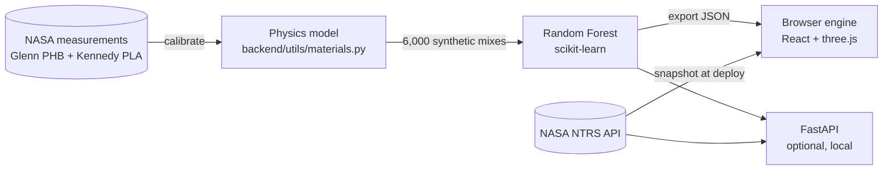

<p align="center">
  
</p>

<h1 align="center">Moon-Material Simulator</h1>

<p align="center">
  Design a building material from moon dust and NASA's bacteria-grown bioplastic, then see how it holds up.<br />
  <strong>Team Dreams of X · NASA Space Apps Challenge 2026</strong>
</p>

<p align="center">
  <a href="https://md8-habibullah.github.io/moon-material-simulator/"><strong>▶ Open the live simulator</strong></a> ·
  <a href="https://youtu.be/1Gtmq5XUytc">Watch the 4-minute pitch</a> ·
  <a href="#documentation">Documentation</a>
</p>

<p align="center">
  <a href="https://github.com/md8-habibullah/moon-material-simulator/actions/workflows/deploy.yml"></a>
  <a href="LICENSE"></a>
</p>

---

## The problem

One broken tool on the Moon can mean months of waiting and a resupply launch at up to **$1 million per kg**
(NASA Glenn, [NTRS 20260007758](https://ntrs.nasa.gov/citations/20260007758)). In September 2026, NASA Glenn Research
Center [showed a new material](https://www.nasa.gov/image-article/nasa-made-material-moon-manufacturing/) that could
be made on site: a **biodegradable plastic grown inside bacteria** fed with CO₂ or crew waste, mixed with **simulated
Moon and Mars dust**. NASA names brackets, wrenches and chairs as first uses.

The open question is which mix to make. With 10% regolith or 50%? Lunar or Martian dust? Is it strong enough for a
wrench, or heat-resistant enough for a sunlit wall panel? You can't test every combination on Earth, and you can't
afford to get it wrong on the Moon.

## What we built

An interactive simulator for designing these composites, which runs entirely in the browser:

| Step | What you do | What happens |
| --- | --- | --- |
| **Design** | Pick a binder (NASA's bacterial PHB, PLA, PEEK or LDPE) and a soil (lunar highlands, lunar mare, Martian); set regolith %, basalt fibre %, grain size and operating temperature. | A Random Forest predicts **8 properties** live, each with an uncertainty band: tensile, stiffness, compressive, flexibility, max service temperature, decomposition temperature, density and thermal conductivity. |
| **Test** | Look at the 3D microstructure, a polarised-light view styled after NASA's micrographs, and property-vs-loading curves with NASA's measured points on top. | Every mix is checked against six real uses (wrench, bracket, chair, lunar wall panel, Mars shelter block and thruster nozzle) at the temperatures each one must survive. |
| **Optimize** | Choose a use. | The optimizer tests about 2,400 compositions and ranks the passing ones, most locally sourced first. It says honestly when nothing works: no plastic survives a thruster nozzle. |
| **Plan** | Compare up to four formulas; estimate mission impact. | Radar chart, winners per property and CSV export, plus launch mass and cost avoided by printing parts on site. |

## Built on NASA data

The model is calibrated and checked against **56 NASA measurements** from two NASA studies, and every
binder property comes from a NASA table. Full details are in [docs/data_sources.md](docs/data_sources.md).

| NASA source | What we used |
| --- | --- |
| [NASA Glenn: "Under the Microscope" (Sep 2026)](https://www.nasa.gov/image-article/nasa-made-material-moon-manufacturing/) | The core idea and target uses |
| [NTRS 20260007758: Christy, NASA Glenn, ACS 2026](https://ntrs.nasa.gov/citations/20260007758) | PHB + five lunar/Martian simulants: tensile strength (slide 17), decomposition temperature and crystallinity (slide 9), launch-cost range |
| [NTRS 20260003641: Christy et al., NASA Glenn, 2026](https://ntrs.nasa.gov/citations/20260003641) | Processing routes, loadings up to 80 wt% |
| [NTRS 20230015024: Gelino et al., NASA Kennedy, 2023](https://ntrs.nasa.gov/citations/20230015024) | Binder properties at room temperature and 77 K (Appendix Table 8); 18 measured 3D-printed LHS-1/BP-1 + PLA results (Tables 2–4) |
| [NASA Technical Reports Server API](https://ntrs.nasa.gov) | A searchable index of related NASA reports inside the app (live when the backend runs; a snapshot on the hosted site) |

**Accuracy.** On held-out data the forest scores R² 0.989–0.9997 for all eight properties. Against NASA's
measurements, the mean error is **6%** for NASA Glenn's PHB data and **17%** for NASA Kennedy's printed PLA data.
Most of that is the spread between 0° and 90° print directions, which the model averages. See
[docs/science_model.md](docs/science_model.md).

**Honest limits.** The training set is synthetic: physics-based composite models fitted to those NASA points. Use the
numbers to explore trends and shortlist mixes, not as qualified design values.

## How it works



1. **Physics-informed features.** The mix is turned into volume fractions, grain bond, porosity and density, computed
   identically in Python and JavaScript.
2. **Random Forest.** 28 trees predict room-temperature properties as ratios to the pure binder. The spread between
   trees is the ± band.
3. **Temperature physics.** NASA's measured 77 K ratios on the cold side; softening around the predicted service
   temperature on the hot side.

The hosted site runs the exported forest in your browser, and a parity test checks it against Python on 60 random
mixes. More in [docs/architecture.md](docs/architecture.md).

## Run it locally

You need Python 3.11+ and Node.js 20.19+.

```bash
# 1. Frontend only (the model runs in the browser): http://127.0.0.1:5173
cd frontend
npm install
npm run dev

# 2. Optional backend for the REST API and live NASA NTRS search: http://127.0.0.1:8000/docs
cd backend
python -m venv .venv && source .venv/bin/activate   # Windows: .venv\Scripts\activate
pip install -r requirements-dev.txt
uvicorn main:app --reload --host 127.0.0.1 --port 8000
```

To change the science and retrain:

```bash
cd backend
python -m data.generate_dataset      # rebuild the synthetic training set
python -m scripts.export_frontend    # retrain, export the model + catalog + NTRS snapshot for the browser
pytest                               # 39 tests: API, science vs NASA data, export parity
cd ../frontend && npm test           # browser engine matches Python; optimizer; mission maths
```

## Documentation

| Document | What's in it |
| --- | --- |
| [Architecture](docs/architecture.md) | Components, data flow, design decisions |
| [Science model](docs/science_model.md) | Every equation, the NASA calibration and its residuals, limitations |
| [Data dictionary](docs/data_dictionary.md) | Inputs, outputs, ranges and dataset columns |
| [NASA data sources](docs/data_sources.md) | Each NASA source and exactly how it is used |
| [API reference](docs/api.md) | FastAPI endpoints with examples |
| [Deployment](docs/deployment.md) | GitHub Pages setup and the CI pipeline |
| [Demo script](docs/demo_script.md) | A 90-second walkthrough for judges |

## Tech stack

| Layer | Tools |
| --- | --- |
| Frontend | React 19, Vite 8, three.js, Chart.js, lucide icons |
| In-browser ML | Exported scikit-learn Random Forest (custom JS evaluator) |
| Backend | Python 3, FastAPI, Pydantic |
| Science and ML | scikit-learn, NumPy, pandas |
| Hosting and CI | GitHub Pages, GitHub Actions |

## Project structure

```text
moon-material-simulator/
├── backend/
│   ├── main.py                     # FastAPI app: predict, compare, catalog, validation, NTRS search
│   ├── utils/materials.py          # Material catalogue + physics model (NASA-calibrated)
│   ├── utils/applications.py       # Uses the optimizer designs for (wrench, panel, nozzle...)
│   ├── utils/data_processor.py     # Physics-informed features shared with the browser
│   ├── models/property_model.py    # Random Forest: training, prediction, JSON export
│   ├── services/                   # NTRS client, catalog builder
│   ├── scripts/export_frontend.py  # Writes frontend/src/generated/*
│   ├── data/                       # Synthetic dataset, NASA reference points, generator
│   └── tests/                      # API, science-vs-NASA and export-parity tests
├── frontend/
│   ├── src/lib/engine/             # Browser engine: forest, physics, optimizer, mission maths
│   ├── src/components/             # Simulator, optimizer, comparison, impact, science, research
│   ├── src/generated/              # Model + catalog exported from Python
│   └── test/                       # Node tests for the engine
├── docs/                           # Architecture, science, data, API, deployment, demo
└── .github/workflows/deploy.yml    # Test, build and publish to GitHub Pages
```

## Team: Dreams of X

- **Mahdin Islam Mukim** (Team Lead)
- **Yousuf Abdullah** (Data Scientist)
- **Md. Habibullah Sharif** (Systems Architect)
- **Maliha Sanjana** (UI/UX Designer)
- **Lamisa Yeasmin Nakia** (Research & Storytelling Lead)

## License

[MIT](LICENSE). NASA material is used as public-domain U.S. Government work and cited throughout. This project is not
endorsed by NASA.
