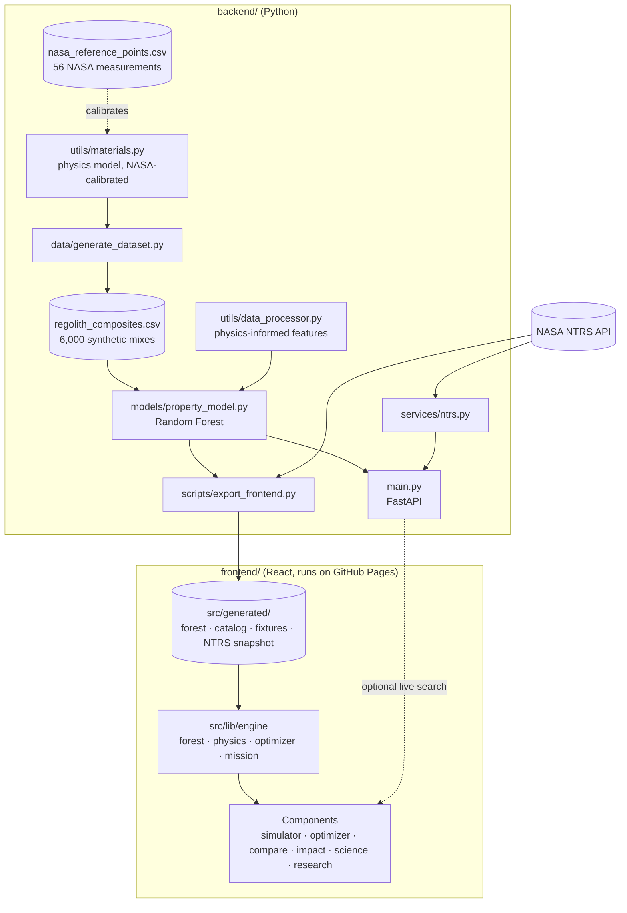

# Architecture

[← Back to README](../README.md)

## Overview

## Design decisions

**The model runs in the browser.** GitHub Pages only serves static files, so the trained forest is exported to JSON
(28 trees, about 580 KB gzipped) and evaluated by `frontend/src/lib/engine/forest.js`. Every prediction is instant and
works offline once loaded. The FastAPI backend serves the same model for scripts, notebooks and live NTRS search.

**One model, two runtimes, a parity test.** `physics.js` mirrors `materials.py` and `data_processor.py` line for line.
The export writes 60 random mixes with Python's predictions to `parity_fixtures.json`, and `npm test` fails if the
browser differs by more than 0.1%. Thresholds are compared the way scikit-learn does (`float32(x) <= threshold`).

**Hybrid ML + physics.** The forest learns composition → room-temperature properties as log-ratios to the pure binder.
Temperature is applied afterwards with explicit physics. Without this split, temperature (a 2–10× effect) swamped the
subtler effects of soil type and grain size, and the forest ignored them. See [science_model.md](science_model.md).

**Physics-informed features.** Volume fractions, grain bond, porosity, grain stiffness and theoretical density are
cheap, deterministic functions of the inputs. Feeding them to the forest lets a small model capture second-order
effects.

**No pickles.** The model trains from the CSV in about a second, so the repository holds no opaque binaries and nothing
is unpickled from disk.

**NASA research on a static site.** NTRS sends no CORS headers, so browsers can't query it directly. The build step
snapshots related reports into `ntrs_snapshot.json`. When the backend runs, the research panel switches to live search
through `/api/research`.

## Request flow (simulator)

1. A control changes the composition (state lives in `App.jsx` and is mirrored to the URL for sharing).
2. `engine.predict()` encodes features, walks 28 trees, maps each leaf back to real units, applies temperature factors
   per tree, then returns the mean and spread.
3. Panels re-render: readouts with deltas versus the pure binder, the composition donut, "fit for use" checks (each use
   evaluated at its own temperatures), 3D view, micrograph and curves.

## Security notes

- The NTRS proxy has a fixed host and path. Only the URL-encoded query is caller-controlled, and it is validated (2–100
  chars, safe character set). Responses are size-capped, time-limited and cached, upstream calls are rate-limited, and
  upstream errors are never echoed to clients.
- Inputs are validated with Pydantic (ranges, total filler ≤ 85 wt%, known materials only).
- Dev servers bind to `127.0.0.1`; CORS origins come from `ALLOWED_ORIGINS`.
- CI actions are pinned to commit SHAs.
