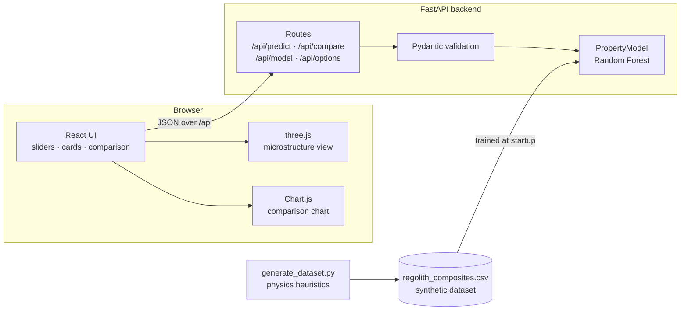

# Architecture

## Request flow

1. The user changes a slider or option. The UI waits 200 ms (debounce), cancels any request still in
   flight, and sends one `POST /api/compare` with two items: the current mix and the same polymer
   with 0 % regolith. The second item powers the "vs pure polymer" deltas.
2. FastAPI validates the body with Pydantic: regolith 0–50 wt%, temperature −180 to 150 °C, and known
   polymer and regolith names only. Anything else gets a 422.
3. `PropertyModel.predict` encodes the features, asks every tree for a prediction, and returns the
   mean and the spread across trees.
4. The response adds units, the filler volume fraction, and whether the mix survives the surface's
   maximum temperature.

## Design decisions

- **No pickled model in the repo.** The model trains from the CSV at startup in about a second. That
  keeps the repository reviewable and avoids unpickling files from disk.
- **One encoder for training and serving** (`utils/data_processor.py`), so features can't drift
  between the two.
- **Localhost by default.** The dev servers bind to `127.0.0.1`; CORS origins come from the
  `ALLOWED_ORIGINS` environment variable when the frontend is hosted elsewhere.
- **three.js is lazy-loaded**, so the controls and predictions render before the 3D bundle arrives.
